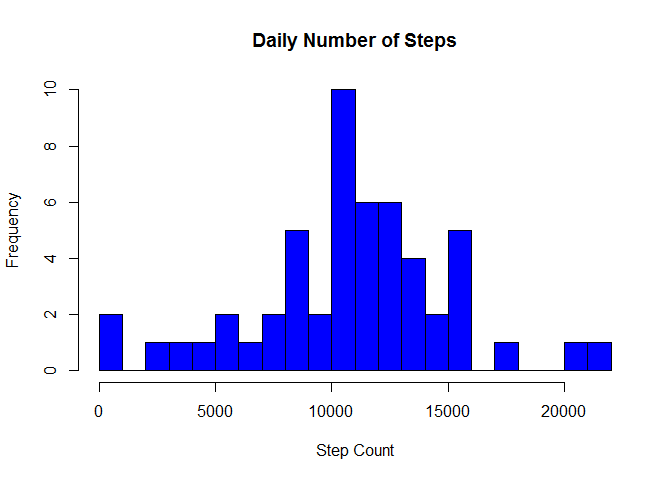
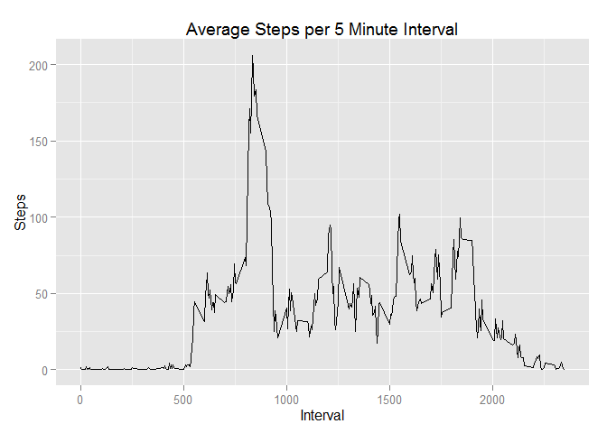
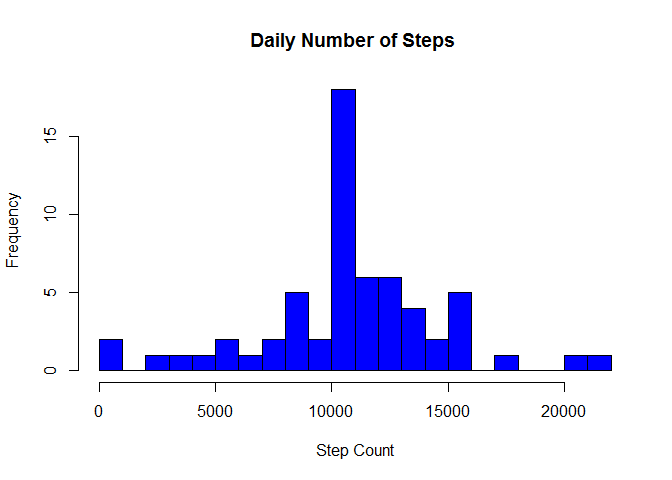
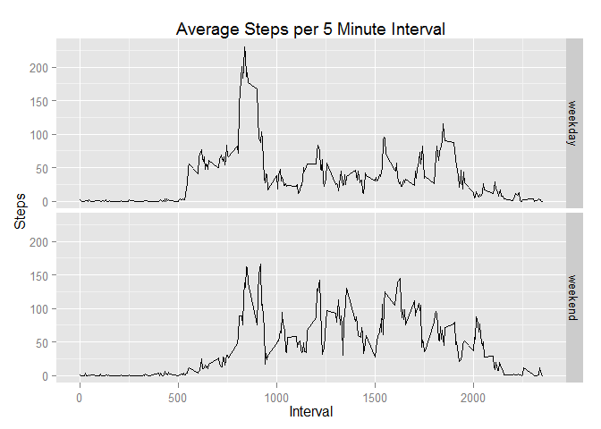

# Reproducible Research: Peer Assessment 1
ksplett1  


<hr />
Data Set:
https://d396qusza40orc.cloudfront.net/repdata%2Fdata%2Factivity.zip

Data Set Description:

* 17,568 observations collected between October and November 2012 (2 months) from a personal activity monitoring device. 
* Each record are measurements for an individual of number of steps sampled at 5-minute intervals.
* .csv file format

Variables:

steps:    number of steps in a 5-minute interval (missing values are coded as NA) <br />
date:     measurement date in YYYY-MM-DD format <br />
interval: identifier for the 5-minute interval <br />


```r
library(ggplot2)
```

```
## Warning: package 'ggplot2' was built under R version 3.1.1
```

<hr />
### Load and preprocess dataset ###


```r
setwd("c:/Users/ksplett1/repData2/RepData_PeerAssessment1")
stepdf <- read.csv(unz("data/repdata-data-activity.zip", "activity.csv" ),
        header = TRUE, sep = ",", na.strings = "NA",
        colClasses = c("numeric", "character", "numeric"),
  	    col.names  = c("Steps", "IntervalDate", "Interval")
	    )

# convert date and time variables to R POSIX date/time data types
stepdf$dateInterval <- as.Date(stepdf$IntervalDate, "%Y-%m-%d")

stepdf_noMissing <- with(stepdf, stepdf[! is.na(Steps),])
```

<br />
<hr />
### What is the mean total number of steps taken per day? ###
<br />


```r
stepsByDay <- aggregate(Steps ~ IntervalDate, stepdf_noMissing, FUN = sum)

hist(stepsByDay$Steps, col="blue1", breaks = 20, 
     main = "Daily Number of Steps",
     xlab = "Step Count"
     )
```

 

```r
meanSteps <- as.integer(round(mean(stepsByDay$Steps)))
medianSteps <- as.integer(round(median(stepsByDay$Steps)))
```

10766 = Mean number of steps per day  <br />
10765 = Median number of steps per day

<br />
<hr />
### What is the average daily activity pattern? ###
<br />


```r
stepsByInterval <- aggregate(Steps ~ Interval, stepdf_noMissing, FUN = mean)

ggplot(data=stepsByInterval, aes(x=Interval, y=Steps)) + 
           geom_line(stat="identity") +
           ggtitle("Average Steps per 5 Minute Interval")
```

 

```r
maxInterval <- with(stepsByInterval,stepsByInterval[Steps == max(Steps),]$Interval)
```


835 = 5 Minute Interval with Max Mean steps per day

<br />
<hr />
### Imputing missing values ###
<br />


```r
nbrIntMissingSteps <- nrow(stepdf) - nrow(stepdf_noMissing)

# fill in NA step values with mean steps for that interval
colnames(stepsByInterval)[2] <- "MeanSteps"
stepdf_imputed <- merge(stepdf, stepsByInterval)
stepdf_imputed[is.na(stepdf_imputed$Steps),]$Steps <- 
      round(stepdf_imputed[is.na(stepdf_imputed$Steps),]$MeanSteps, digits = 2)
stepsByDay2 <- aggregate(Steps ~ IntervalDate, stepdf_imputed, FUN = sum)

hist(stepsByDay2$Steps, col="blue1", breaks = 20,
     main = "Daily Number of Steps ",
     xlab = "Step Count"
     )
```

 

```r
meanSteps2 <- as.integer(round(mean(stepsByDay2$Steps)))
medianSteps2 <- as.integer(round(median(stepsByDay2$Steps)))

meanDiff <- meanSteps2 - meanSteps
medianDiff <- medianSteps2 - medianSteps
```

2304 = Number of 5 Minute Intervals Missing Values

After the interval mean is substituted for intervals with missing steps, the new mean and median are:

10766 = Mean number of steps per day  <br />
10765 = Median number of steps per day

The change in mean number of steps is barely detectable (0). <br />
The median changed about one step (1).


These values only change very slightly from the initial values because the NA values are replaced with the average number of steps for the interval. There is very little impact of imputing missing data on the estimates of the total daily number of steps.


<br />
<hr />
### Are there differences in activity patterns between weekdays and weekends? ###
<br />


```r
# convert IntervalDate to date type
# create a factor for weekday and weekend days
stepdf_imputed$dateInterval <- as.Date(stepdf_imputed$IntervalDate, "%Y-%m-%d")
stepdf_imputed$IsWeekend <- (weekdays(stepdf_imputed$dateInterval) == "Saturday" | 
                             weekdays(stepdf_imputed$dateInterval) == "Sunday" )
stepdf_imputed$TypeOfDay <- "weekday"
stepdf_imputed[stepdf_imputed$IsWeekend == TRUE, ]$TypeOfDay <- "weekend"
stepdf_imputed$TypeOfDay <- factor(stepdf_imputed$TypeOfDay)

stepdf_daytype <- aggregate(Steps ~ Interval + TypeOfDay, stepdf_imputed, FUN = mean)

plotdaytype <- ggplot(data=stepdf_daytype, aes(x=Interval, y=Steps)) + 
               geom_line(stat="identity") +
               ggtitle("Average Steps per 5 Minute Interval")
plotdaytype <- plotdaytype  + facet_grid(TypeOfDay ~ .)

plotdaytype
```

 

There is higher level of activity during weekday mornings than weekend mornings. Weekend activity is more consistently spread over the late morning to early evening.
